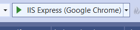
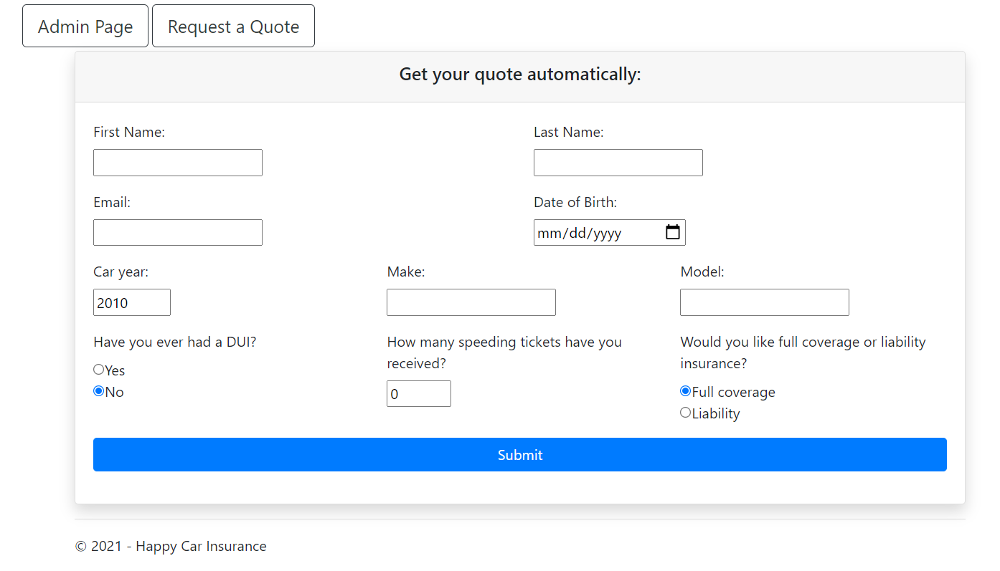
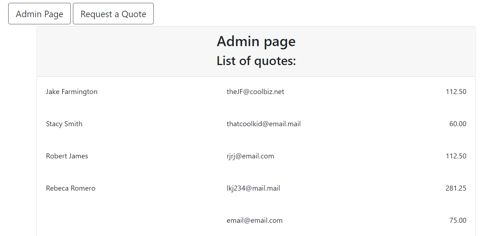

# Car Insurance Quote Generator Demo
1. Click CarInsuranceQuote.sln to run in Visual Studio.
2. Press F5 or click the play button to run the web page.

3. Enter details into the form.

4. In the admin page, see relevant information of all generated quotes.

